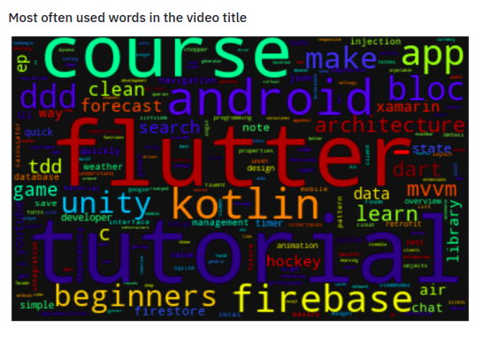

<!-- PROJECT LOGO -->
<br />
<p align="center">
    

  <h2 align="center">Youtube Channels Analysis</h2>

  <p align="center">
    A webapp where you can paste a URL of a youtube channel and get some cool visualizations.
    <br />
    <a href="https://yt-channels-analysis.herokuapp.com/"><strong>Check webapp here »</strong></a>
    <br />
    <br />
  </p>
</p>


<!-- TABLE OF CONTENTS -->
<details open="open">
  <summary>Table of Contents</summary>
  <ol>
    <li>
      <a href="#about-the-project">About The Project</a>
      <ul>
        <li><a href="#built-with">Built With</a></li>
      </ul>
    </li>
    <li>
      <a href="#getting-started">Getting Started</a>
      <ul>
        <li><a href="#prerequisites">Prerequisites</a></li>
        <li><a href="#installation">Installation</a></li>
      </ul>
    </li>
    <li><a href="#more-screenshots">More Screenshots</a></li>
    <li><a href="#contributing">Contributing</a></li>
  </ol>
</details>


<!-- ABOUT THE PROJECT -->
## About The Project

[![Product Name Screen Shot][product-screenshot]](  )

This is a fun webapp where you can see some analysis of your favourite youtuber, like what is the most watched video, which videos had higher percent of dislikes,
the yearwise, monthwise and daywise upload pattern of the channel owner and the most commonly used words in the video title.  

### Built With

Here are the main tools/services used to build this webapp
* [Streamlit](https://www.streamlit.io/)
* [Plotly](https://plotly.com)
* [Pandas](https://pandas.com)
* [Youtube Data API](https://laravel.com)
* [Heroku](https://heroku.com)


<!-- GETTING STARTED -->
## Getting Started

These are the steps to followed if you want to setup this project locally.
To get a local copy up and running follow these simple example steps.

### Prerequisites

You should have Python (version >= 3.6) installed in your system.

### Installation

1. Get a free API Key at [Google API](https://developers.google.com/youtube/v3/getting-started)
2. Clone the repo
   ```sh
   git clone https://github.com/ssreeramj/youtube_channels_analysis
   ```
3. Install required libraries
   ```sh
   pip install -r requirements.txt
   ```
4. Enter your API Key in a `.env` file without the quotes
   ```JS
   YOUTUBE_API_KEY='ENTER YOUR API'
   ```


<!-- USAGE EXAMPLES -->
## More screenshots

<p float="left">
  
   
</p>


<!-- CONTRIBUTING -->
## Contributing

Contributions are what make the open source community such an amazing place to be learn, inspire, and create. Any contributions you make are **greatly appreciated**.

1. Fork the Project
2. Create your Feature Branch (`git checkout -b feature/AmazingFeature`)
3. Commit your Changes (`git commit -m 'Add some AmazingFeature'`)
4. Push to the Branch (`git push origin feature/AmazingFeature`)
5. Open a Pull Request


<!-- LICENSE
## License

Distributed under the MIT License. See `LICENSE` for more information.


<!-- CONTACT -->
<!-- ## Contact -->

<!-- Your Name - [@your_twitter](https://twitter.com/your_username) - email@example.com

Project Link: [https://github.com/your_username/repo_name](https://github.com/your_username/repo_name) --> 


<!-- ACKNOWLEDGEMENTS -->
<!-- ## Acknowledgements -->
<!-- * [GitHub Emoji Cheat Sheet](https://www.webpagefx.com/tools/emoji-cheat-sheet)
* [Img Shields](https://shields.io)
* [Choose an Open Source License](https://choosealicense.com)
* [GitHub Pages](https://pages.github.com)
* [Animate.css](https://daneden.github.io/animate.css)
* [Loaders.css](https://connoratherton.com/loaders)
* [Slick Carousel](https://kenwheeler.github.io/slick)
* [Smooth Scroll](https://github.com/cferdinandi/smooth-scroll)
* [Sticky Kit](http://leafo.net/sticky-kit)
* [JVectorMap](http://jvectormap.com)
* [Font Awesome](https://fontawesome.com) -->


<!-- MARKDOWN LINKS & IMAGES -->
<!-- https://www.markdownguide.org/basic-syntax/#reference-style-links -->
[contributors-shield]: https://img.shields.io/github/contributors/othneildrew/Best-README-Template.svg?style=for-the-badge
[contributors-url]: https://github.com/othneildrew/Best-README-Template/graphs/contributors
[forks-shield]: https://img.shields.io/github/forks/othneildrew/Best-README-Template.svg?style=for-the-badge
[forks-url]: https://github.com/othneildrew/Best-README-Template/network/members
[stars-shield]: https://img.shields.io/github/stars/othneildrew/Best-README-Template.svg?style=for-the-badge
[stars-url]: https://github.com/othneildrew/Best-README-Template/stargazers
[issues-shield]: https://img.shields.io/github/issues/othneildrew/Best-README-Template.svg?style=for-the-badge
[issues-url]: https://github.com/othneildrew/Best-README-Template/issues
[license-shield]: https://img.shields.io/github/license/othneildrew/Best-README-Template.svg?style=for-the-badge
[license-url]: https://github.com/othneildrew/Best-README-Template/blob/master/LICENSE.txt
[linkedin-shield]: https://img.shields.io/badge/-LinkedIn-black.svg?style=for-the-badge&logo=linkedin&colorB=555
[linkedin-url]: https://linkedin.com/in/othneildrew
[product-screenshot]: images/screenshot.png
